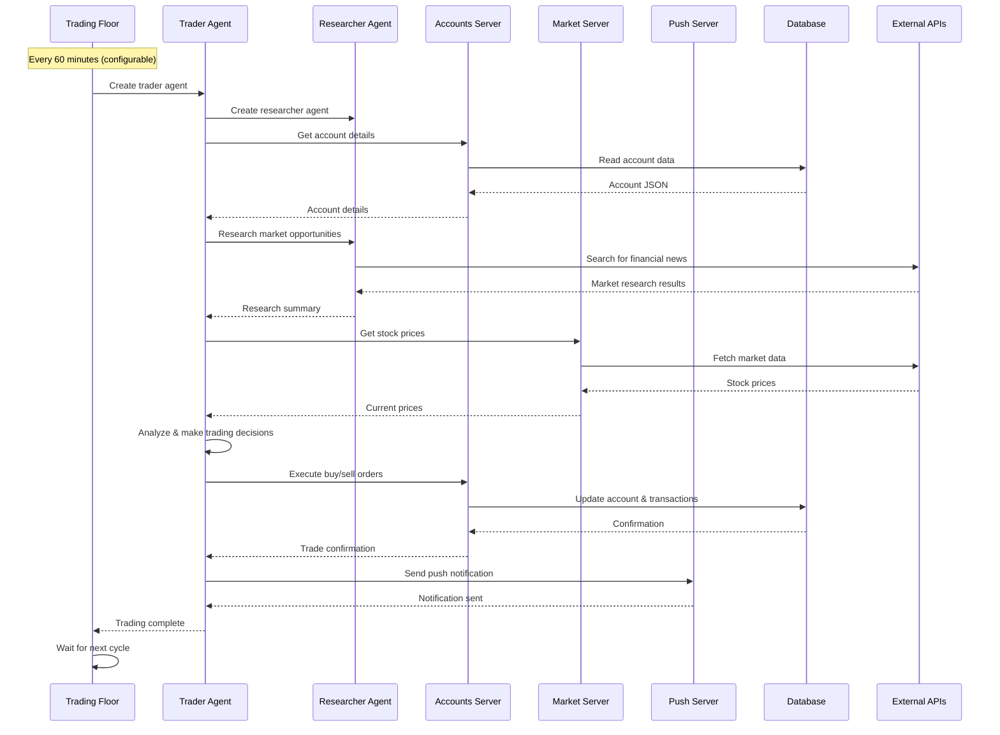
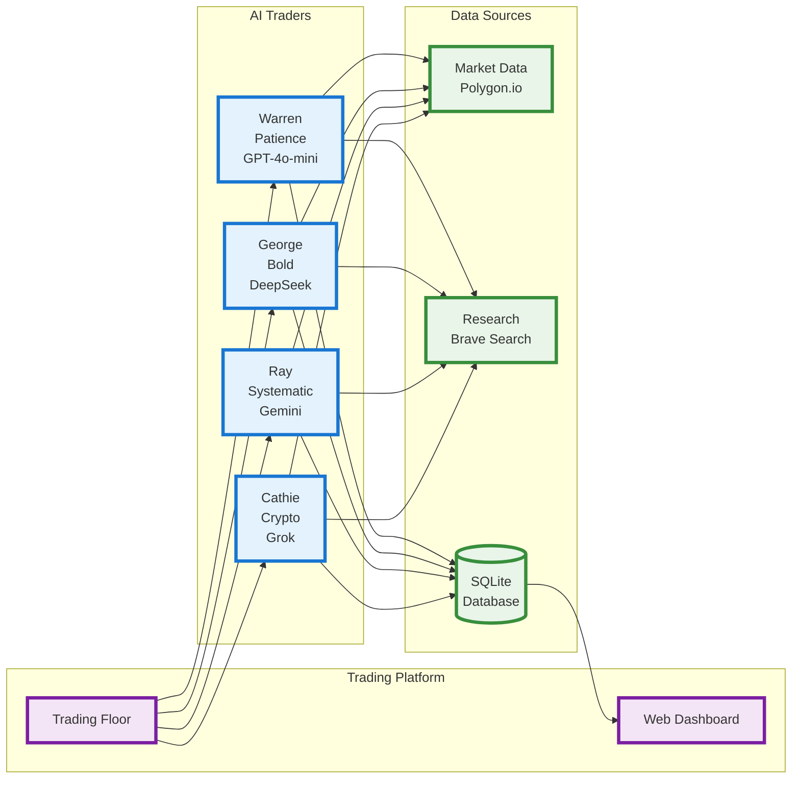

# Trade Sales - Project Flow Diagrams

## 🔄 Trading Cycle

```mermaid
sequenceDiagram
    participant TF as Trading Floor
    participant TA as Trader Agent
    participant RA as Researcher Agent
    participant AS as Accounts Server
    participant MS as Market Server
    participant PS as Push Server
    participant DB as Database
    participant API as External APIs

    Note over TF: Every 60 minutes (configurable)
    
    TF->>TA: Create trader agent
    TA->>RA: Create researcher agent
    TA->>AS: Get account details
    AS->>DB: Read account data
    DB-->>AS: Account JSON
    AS-->>TA: Account details
    
    TA->>RA: Research market opportunities
    RA->>API: Search for financial news
    API-->>RA: Market research results
    RA-->>TA: Research summary
    
    TA->>MS: Get stock prices
    MS->>API: Fetch market data
    API-->>MS: Stock prices
    MS-->>TA: Current prices
    
    TA->>TA: Analyze & make trading decisions
    TA->>AS: Execute buy/sell orders
    AS->>DB: Update account & transactions
    DB-->>AS: Confirmation
    AS-->>TA: Trade confirmation
    
    TA->>PS: Send push notification
    PS-->>TA: Notification sent
    
    TA-->>TF: Trading complete
    TF->>TF: Wait for next cycle
```

## 📊 Simplified System Overview

```mermaid
graph LR
    subgraph "Trading Platform"
        TF[Trading Floor]
        UI[Web Dashboard]
    end
    
    subgraph "AI Traders"
        W[Warren<br/>Patience<br/>GPT-4o-mini]
        G[George<br/>Bold<br/>DeepSeek]
        R[Ray<br/>Systematic<br/>Gemini]
        C[Cathie<br/>Crypto<br/>Grok]
    end
    
    subgraph "Data Sources"
        M[Market Data<br/>Polygon.io]
        R2[Research<br/>Brave Search]
        DB[(SQLite<br/>Database)]
    end
    
    TF --> W
    TF --> G
    TF --> R
    TF --> C
    
    W --> M
    G --> M
    R --> M
    C --> M
    
    W --> R2
    G --> R2
    R --> R2
    C --> R2
    
    W --> DB
    G --> DB
    R --> DB
    C --> DB
    
    DB --> UI
    
    classDef traderClass fill:#e3f2fd,stroke:#1976d2,stroke-width:4px,font-size:16px
    classDef platformClass fill:#f3e5f5,stroke:#7b1fa2,stroke-width:4px,font-size:16px
    classDef dataClass fill:#e8f5e8,stroke:#388e3c,stroke-width:4px,font-size:16px
    
    class W,G,R,C traderClass
    class TF,UI platformClass
    class M,R2,DB dataClass
``` 